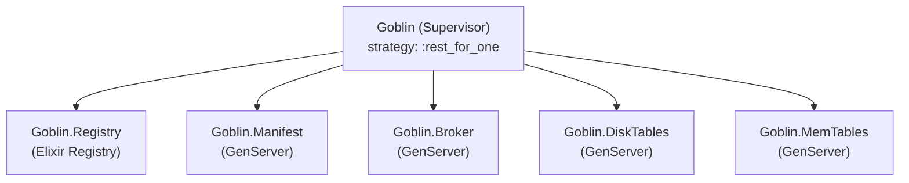
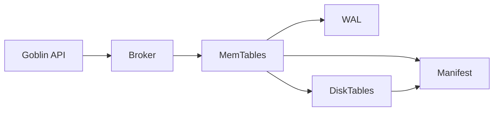
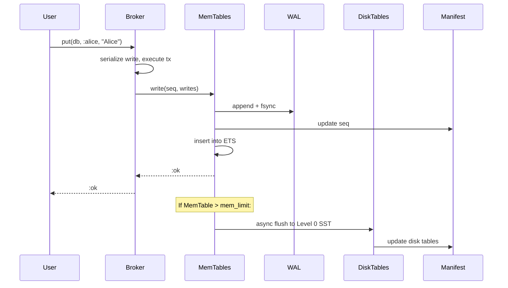
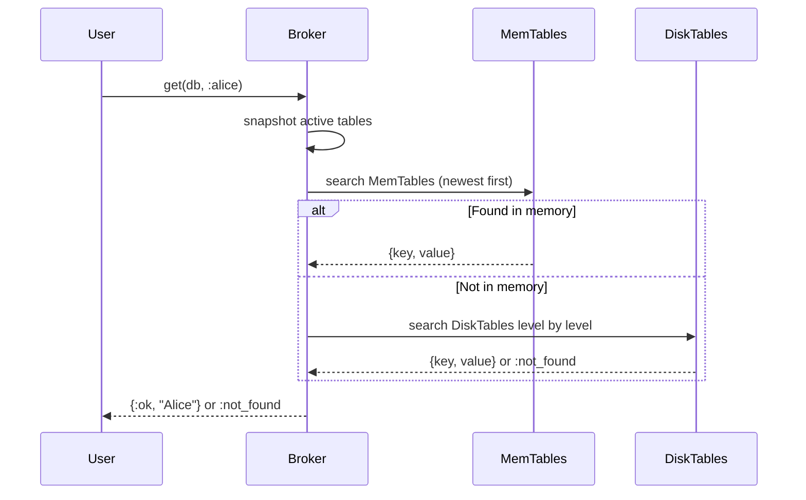
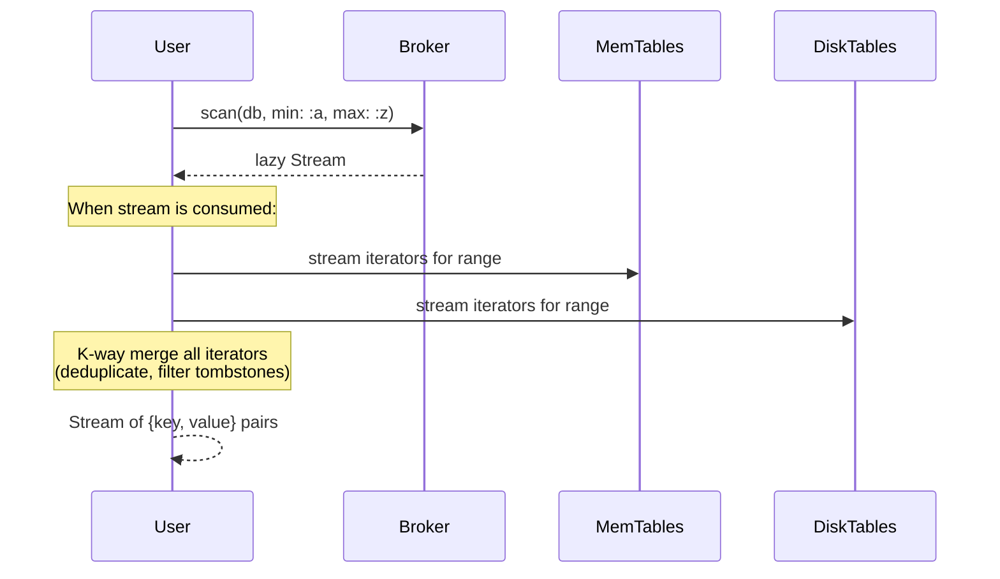
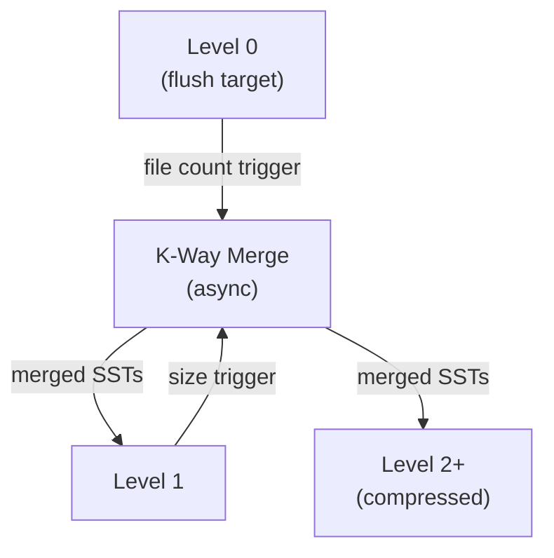
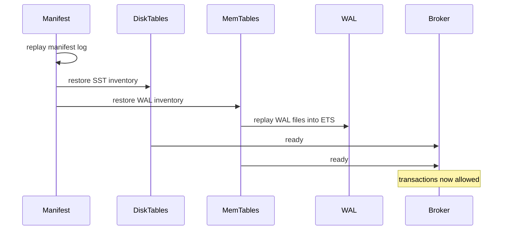

# Architecture

Goblin is an embedded LSM-Tree (Log-Structured Merge-Tree) key-value database for Elixir. It runs inside your application's OTP supervision tree and provides ACID transactions, MVCC snapshot isolation, crash recovery via write-ahead logging, and automatic leveled compaction.

## Supervision Tree

## Core Components

## Write Path

The complete data flow when writing (e.g. `Goblin.put(db, :alice, "Alice")`):

### Write Path Summary

1. **Serialize**: Only one writer at a time (others queue in the Broker)
2. **Durability**: WAL append + fsync **before** updating the MemTable
3. **In-memory update**: Insert into ETS ordered_set as `{key, -seq} → value`
4. **Async flush**: When MemTable exceeds `mem_limit`, flush to Level 0 SST in a background Task
5. **Cleanup**: Old MemTables are soft-deleted via SnapshotRegistry and garbage-collected once no snapshots reference them

## Read Path (Point Lookup)

The data flow when reading (e.g. `Goblin.get(db, :alice)`):

### Read Path Summary

1. **Non-blocking**: Multiple readers run concurrently via MVCC snapshot isolation
2. **Level-by-level search**: MemTables (Level -1) → Level 0 → Level 1 → ... (newest data first)
3. **Early termination**: Once a key is found at a higher level, deeper levels are skipped for that key
4. **Bloom filters + key range checks** eliminate unnecessary disk I/O on DiskTables
5. **Binary search** within SST blocks for O(log n) point lookups

## Range Scan Path

The data flow for `Goblin.scan(db, min: :a, max: :z)`:

## Compaction

### Compaction Rules

- **Level 0**: Triggers when file count >= `flush_level_file_limit` (default 4). All Level 0 files merge with overlapping Level 1 files.
- **Level 1+**: Triggers when total level size >= `level_base_size * level_size_multiplier ^ (level - 1)`. The file with the oldest sequence range merges with overlapping files in the next level.
- **Tombstone removal**: Tombstones are only stripped at the deepest level (no older versions can exist below).
- **Compression**: Levels >= 2 use `:erlang.term_to_binary/2` with the `:compressed` flag.
- Compaction runs as a `Task.async` and does not block reads or writes.

## Recovery on Startup

